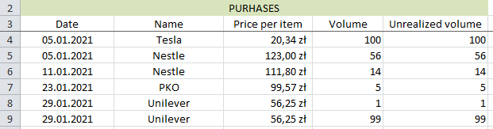
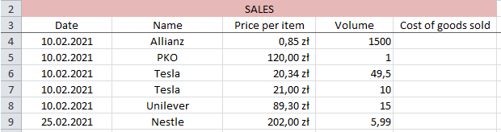

# FIFO Cost Calculator
The FIFO Cost Calculator is a program designed to calculate the cost of revenue in sales transactions using the FIFO (First-In, First-Out) method. It efficiently computes the cost of goods sold based on purchase transactions.

### Table of contents
* [Description](#FIFO-Cost-Calculator)
* [Key Features](#key-features)
* [Usage](#usage)
* [Integration with Excel](#integration-with-excel)
* [Requirements](#requirements)
* [Project Status](#project-status)

## Key Features
FIFO Method: Utilizes the First-In, First-Out method to determine the cost of goods sold in sales transactions.

## Usage
* Manually input transaction data in an excel file or load data from an external source, such as a CSV file.
  
   
* In the "launch_data" sheet, provide initial configuration data.
  
* Run the program to obtain accurate cost of revenue figures.

### INFO
* The volume can be a float number
* The name of a given company in purchase and sale transactions must be the same. The letter case does not matter

### WARNING
* The transaction currency for buying and selling must be the same for a given company
* If the Excel file name is different from the one in the project, change the 'excel_name' variable in the Python file
* When adding a purchase transaction, enter the purchase volume in the 'Unrealized volume' column
* In the configuration sheet 'launch_data,' you cannot move cells. You can only change values

## Integration with Excel
The FIFO Cost Calculator seamlessly integrates with Excel, allowing users to conveniently input and manage transactions using Excel files. Simply open the Excel file, manually enter transactions, and let the program handle the rest.

## Requirements
* [colorama](https://pypi.org/project/colorama/)
* [openpyxl](https://pypi.org/project/openpyxl/)
* [pandas](https://pypi.org/project/pandas/) 

### Project Status
The FIFO Cost Calculator is actively maintained and open to contributions. Feel free to raise issues or contribute to its development.
